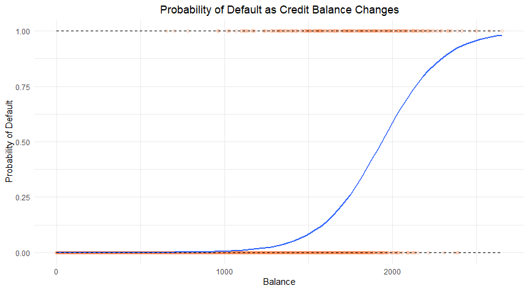
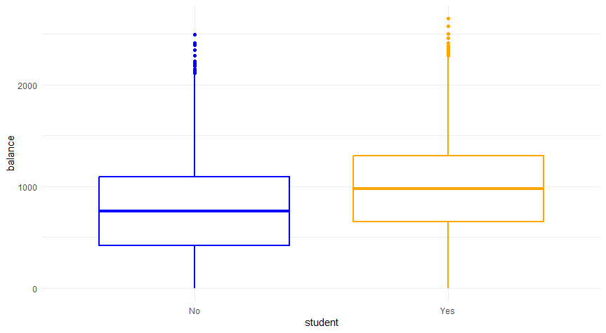

# Credit Default Logistic Regression
## Summary
Here I used logistic regression for hypothesis testing and to predict the likelihood of credit defaults based on the following factors: whether the individual was a student or not (student), credit balance (balance) and the individual's income (income). It was determined that student and balance were statistically significant predictors of default probability while income was not. Final regression coefficient output:

## Data Acquisition
I sourced the data from a built in dataset in the ISLR package in R called 'Default'. The data set includes 10000 observations.

## Data Analysis
Prior to performing any logistic regression I conducted some exploratory data analysis (EDA). I evaluated the relationships between the independent variables and the dependent variable as well as the relationships between the independent variables. Two examples of EDA visualizations: 

Following the EDA I conducted forwards stepwise selection analysis by starting with only one variable: balance and adding variables one by one. Each time a new variable was added I would re-evaluate the slope coefficients and p-values as well as the overall model fit measured by the AIC. The model with the lowest AIC and therefore best fit included: student and balance. Income was deemed a statistically insignificant predictor of default probability as it had a p-value of 0.711, much greater than the standard 0.05 level. This was further proven as the model that included only student and balance had a lower AIC. I then put together a confusion matrix to evaluate the accuracy, error rate, sensitivity and specificty of the model. The model had an accuracy rate of 0.9733, an error rate of 0.0267, sensitivty of 0.3153, and specificity of 0.9960. 

## Conclusion
Logistic regression was an effective method in evaluating the predictive power of the given independent variables as well as using them to make predictions of credit defaults. From a qualitative perspective it makes sense that student and balance were significant predictors of credit default probability. For example, if someone carries a larger credit balance it makes sense that they would be more likely to default. Further, if an individual is a student they likely have a shorter credit history and are less established making them more likely to default. Lastly, it is counterintuitive that income was not a significant predictor of default probability. However, the cause of this may be a result of an external variable not included in the data set. It would be interesting to examine this topic further.
